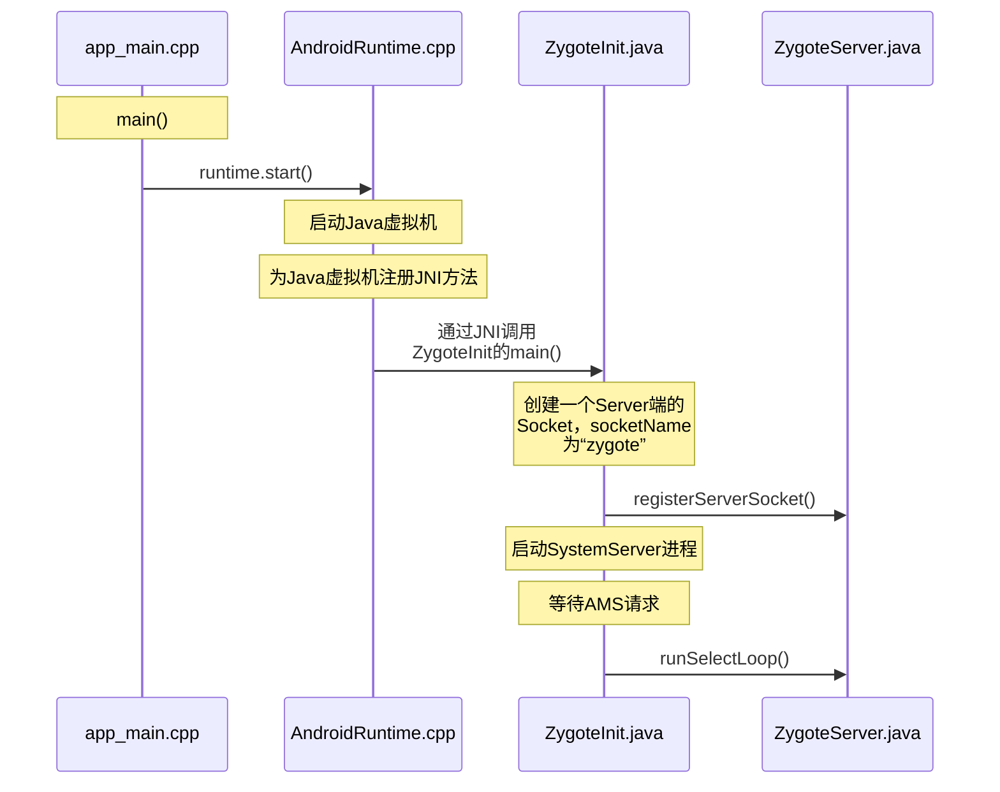

# 系统启动流程概括


启动的主要流程：

1. **启动电源以及系统启动：** 当电源按下时，引导芯片代码从预定义的地方（固化在 ROM）开始执行。加载引导程序 BootLoader 到 RAM，然后执行。
2. **引导程序 Bootloader：** 引导程序 BootLoader 是在 Android 操作系统开始运行前的一个小程序，它的主要作用是把操作系统拉起来并运行。
3. **Linux 内核启动：** 当内核启动时，设置缓存、被保护存储器、计划列表、加载驱动。当内核完成系统设置时，它首先在系统文件中寻找 `init.rc` 文件，并启动 init 进程 。 
4. **init 进程启动：** 初始化和启动属性服务，井且启动 Zygote 进程。
5. **Zygote 进程启动：** 创建 Java 虚拟机并为 Java 虚拟机注册 JNI 方法，创建服务器端 Socket，启动 SystemServer 进程。
6. **SystemServer 进程启动：** 启动 Binder 线程池和 SystemServiceManager，并且启动各种系统服务。
7. **Launcher 启动：** 被 SystemServer 进程启动的 AMS 会启动 Launcher，Launcher 启动后会将已安装应用的快捷图标显示到界面上。

---

<br/>

# init 进程启动

init 进程是 Android 系统中用户空间的第一个进程，进程号为 1，是 Android 系统启动流程中一个关键的步骤。主要做了以下三件事情：

- 创建和挂载启动所需的文件目录。
- 初始化和启动属性服务。
- 解析 `init.rc` 配置文件并启动 Zygote 进程。

## init 进程的入口函数

在 Linux 内核加载完成后，它首先在系统文件中寻找 `init.rc` 文件（`/system/core/rootdir/init.rc`），并启动 init 进程，然后查看 init 进程的入口 `main` 函数来读取 `init.rc` 中的相关配置，从而来启动其他相关进程以及其他操作。

Android 9 及以前，main 函数在 `/system/core/init/init.cpp` 文件中，以下源码基于 Android 9.0.0：

```c++
int main(int argc, char** argv) {
    /* ... */

    bool is_first_stage = (getenv("INIT_SECOND_STAGE") == nullptr);

    if (is_first_stage) {
        boot_clock::time_point start_time = boot_clock::now();

        // 清理umask.
        umask(0);

        clearenv();
        setenv("PATH", _PATH_DEFPATH, 1);
        // 创建和挂载启动所需要的文件目录
        mount("tmpfs", "/dev", "tmpfs", MS_NOSUID, "mode=0755");
        mkdir("/dev/pts", 0755);
        mkdir("/dev/socket", 0755);
        mount("devpts", "/dev/pts", "devpts", 0, NULL);
        #define MAKE_STR(x) __STRING(x)
        mount("proc", "/proc", "proc", 0, "hidepid=2,gid=" MAKE_STR(AID_READPROC));
        // Don't expose the raw commandline to unprivileged processes.
        chmod("/proc/cmdline", 0440);
        gid_t groups[] = { AID_READPROC };
        setgroups(arraysize(groups), groups);
        mount("sysfs", "/sys", "sysfs", 0, NULL);
        mount("selinuxfs", "/sys/fs/selinux", "selinuxfs", 0, NULL);

        mknod("/dev/kmsg", S_IFCHR | 0600, makedev(1, 11));

        if constexpr (WORLD_WRITABLE_KMSG) {
            mknod("/dev/kmsg_debug", S_IFCHR | 0622, makedev(1, 11));
        }

        mknod("/dev/random", S_IFCHR | 0666, makedev(1, 8));
        mknod("/dev/urandom", S_IFCHR | 0666, makedev(1, 9));

        mount("tmpfs", "/mnt", "tmpfs", MS_NOEXEC | MS_NOSUID | MS_NODEV,
              "mode=0755,uid=0,gid=1000");

        mkdir("/mnt/vendor", 0755);

        // 初始化Kernel的Log，这样就可以从外界获取Kernel的日志
        InitKernelLogging(argv);
        /* ... */
    }
    /* ... */
	// 对属性服务进行初始化
    property_init();
    /* ... */
	// 创建 epoll 句柄
    epoll_fd = epoll_create1(EPOLL_CLOEXEC);
    /* ... */
	// 用于设置子进程信号处理函数，如果子进程(Zygote进程)异常退出，init进程会调用该函数中设定的信号处理函数来进行处理
    sigchld_handler_init();

    /* ... */
	// 导入默认的环境变量
    property_load_boot_defaults();
    export_oem_lock_status();
    // 启动属性服务
    start_property_service();
    set_usb_controller();

    const BuiltinFunctionMap function_map;
    Action::set_function_map(&function_map);

    subcontexts = InitializeSubcontexts();

    ActionManager& am = ActionManager::GetInstance();
    ServiceList& sm = ServiceList::GetInstance();

    // 加载启动脚本，具体内容看下面的函数👇
    LoadBootScripts(am, sm);
    
	if (false) DumpState();
    /* ... */
    while (true) {
        /* ... */
        if (!(waiting_for_prop || Service::is_exec_service_running())) {
            // 内部遍历执行每个action中携带的command对应的执行函数
            am.ExecuteOneCommand();
        }
        if (!(waiting_for_prop || Service::is_exec_service_running())) {
            if (!shutting_down) {
                // 重启死去的进程
                auto next_process_restart_time = RestartProcesses();
                /* ... */
            }
			/* ... */
        }
		/* ... */
    }
    
    return 0;
}

static void LoadBootScripts(ActionManager& action_manager, ServiceList& service_list) {
    Parser parser = CreateParser(action_manager, service_list);

    std::string bootscript = GetProperty("ro.boot.init_rc", "");
    if (bootscript.empty()) {
        // 解析init.rc配置文件
        parser.ParseConfig("/system/etc/init/hw/init.rc");
        if (!parser.ParseConfig("/system/etc/init")) {
            late_import_paths.emplace_back("/system/etc/init");
        }
        parser.ParseConfig("/system_ext/etc/init");
        if (!parser.ParseConfig("/vendor/etc/init")) {
            late_import_paths.emplace_back("/vendor/etc/init");
        }
        if (!parser.ParseConfig("/odm/etc/init")) {
            late_import_paths.emplace_back("/odm/etc/init");
        }
        if (!parser.ParseConfig("/product/etc/init")) {
            late_import_paths.emplace_back("/product/etc/init");
        }
    } else {
        parser.ParseConfig(bootscript);
    }
}
```

Android 10 及以后，main 函数在 `/system/core/init/main.cpp` 文件中，以下源码基于 Android 10.0.0：

```c++
// argc表示argv中有多少个参数
// 参数argv可能有四种情况，进入不同的入口
int main(int argc, char** argv) {
#if __has_feature(address_sanitizer)
    __asan_set_error_report_callback(AsanReportCallback);
#endif
	// 参数中有ueventd，进入ueventd_main，ueventd主要是负责设备节点的创建、权限设定等一些列工作
    if (!strcmp(basename(argv[0]), "ueventd")) {
        return ueventd_main(argc, argv);
    }

    if (argc > 1) {
        // 参数中有subcontext，进入InitLogging和SubcontextMain，初始化日志系统
        if (!strcmp(argv[1], "subcontext")) {
            android::base::InitLogging(argv, &android::base::KernelLogger);
            const BuiltinFunctionMap function_map;

            return SubcontextMain(argc, argv, &function_map);
        }
		// 参数中有selinux_setup，进入SetupSelinux，启动Selinux安全策略
        if (!strcmp(argv[1], "selinux_setup")) {
            return SetupSelinux(argv);
        }
		// 参数中有second_stage，进入SecondStageMain，启动init进程第二阶段
        if (!strcmp(argv[1], "second_stage")) {
            return SecondStageMain(argc, argv);
        }
    }
	// 启动init进程第一阶段（函数定义在/system/core/init/init.cpp中）
    return FirstStageMain(argc, argv);
}
```

综上，main 函数主要做了以下关键步骤：

- 创建和挂载启动所需要的文件目录：挂载 `tmpfs`、`devpts`、`proc`、`sysfs` 和 `selinuxfs` 5种文件系统，这些都是系统运行时目录。
- property_init()：对属性进行初始化。
- signal_handler_init()：设置子进程信号处理函数，用于防止 init 进程的子进程（Zygote）成为**僵尸进程**。
- start_property_service()：启动属性服务。
- parser.ParseConfig("/system/etc/init/hw/init.rc")：解析 `init.rc` 文件。
- restart_processes()：重启死去的进程。

**【僵尸进程】**

父进程使用 fork 创建子进程，如果子进程终止后，父进程并不知道，而且在系统进程表中仍然保留了它的信息（如进程号、退出状态、运行时间...），则已终止的子进程就是僵尸进程。

系统进程表如果被僵尸进程耗尽的话，系统就可能无法创建新的进程了。

假设 init 进程的子进程 Zygote 终止了，`signal_handler_init()` 内部会找到 Zygote 进程井移除全部信息，再重启 Zygote 服务的启动脚本中带有 `onrestart` 选项的服务，并调用 `restart_processes()` 重启 Zygote 进程。

## 解析 init.rc 文件

 `/system/core/rootdir/init.rc` 是由 Android 初始化语言（Android Init Language）编写的配置文件，主要包含5种类型语句：Action，Command，Service，Option 和 Import。

```c
/* ... */
// 按住系统电源键开机时，会触发此动作
on property:sys.boot_from_charger_mode=1
    class_stop charger
    trigger late-init
/* ... */
// 挂载文件系统并启动核心系统服务。
on late-init
    /* .. */
    // 基于文件加密的设备启动zygote进程
    trigger zygote-start
	/* .. */
```

其中，重要的步骤是启动 zygote 进程。

`/system/core/rootdir/init.zygoteXX.rc` 文件是 Zygote 的启动脚本。

```shell
service zygote /system/bin/app_process64 -Xzygote /system/bin --zygote --start-system-server
    class main
    priority -20
    user root
    group root readproc reserved_disk
    socket zygote stream 660 root system
    socket usap_pool_primary stream 660 root system
    onrestart exec_background - system system -- /system/bin/vdc volume abort_fuse
    onrestart write /sys/power/state on
    onrestart restart audioserver
    onrestart restart cameraserver
    onrestart restart media
    onrestart restart netd
    onrestart restart wificond
    writepid /dev/cpuset/foreground/tasks
```

Service 用于通知 `init` 进程创建名为 `zygote` 的进程，执行程序路径为 `/system/bin/app_process64`，后面的是要传给 `app_process64` 的参数，且 Zygote 的 `classname` 为 `main`。如果 `audioserver`、`cameraserver`、`media` 等进程终止了，就需要进行 restart。

---

<br/>

# Zygote 进程启动

Zygote 进程称为孵化器，DVM 和 ART 是由它创建的，APP进程和系统的 SystemServer 进程是由它 fock（复制进程） 创建的，因此可以在内部获取一个 DVM 或者 ART 的实例副本。

> Zygote 进程的名称并不是“zygote”，而是“app_process”，这个名称是在 Android.mk 中定义的。Zygote 进程启动后，Linux 系统下的 pctrl 系统会调用 app_process，将其名称换成了“zygote”。

## 启动过程



