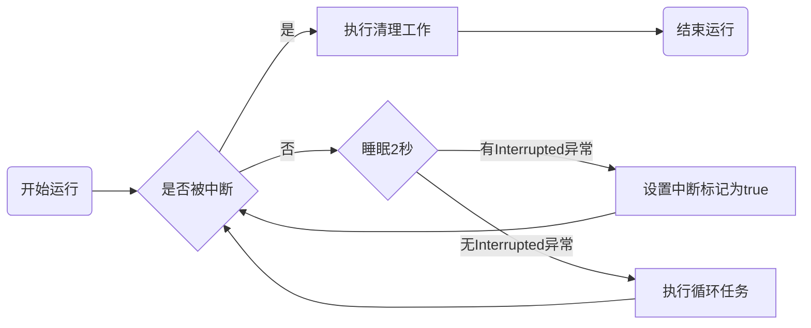
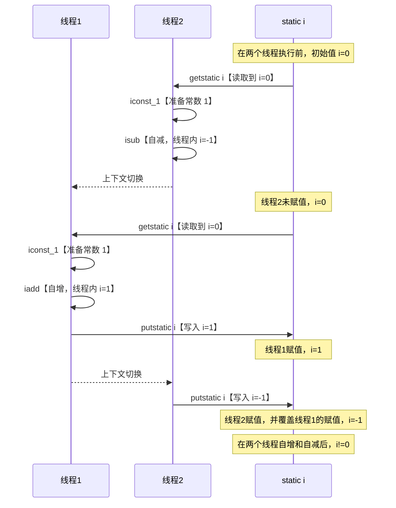
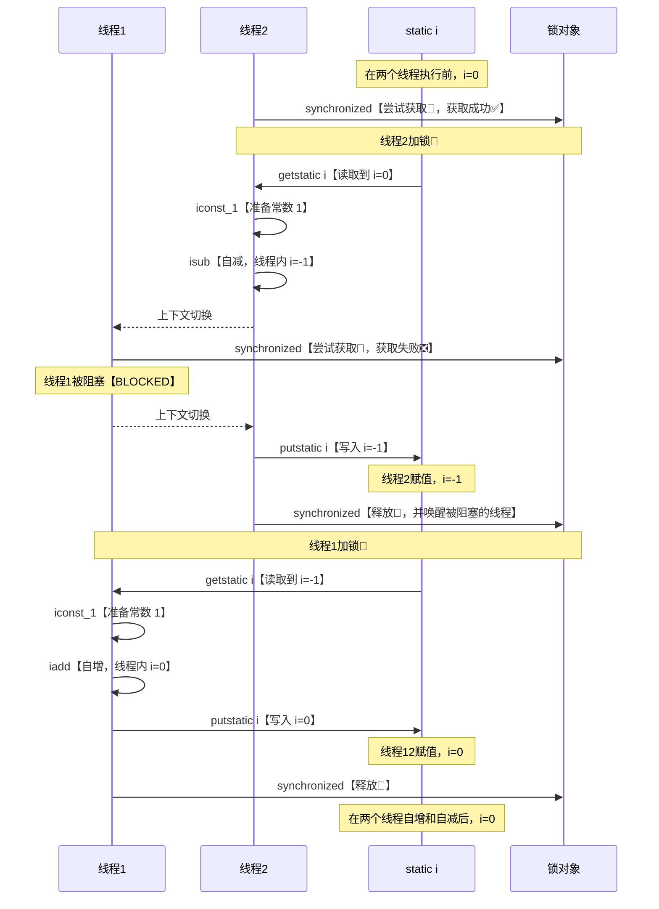
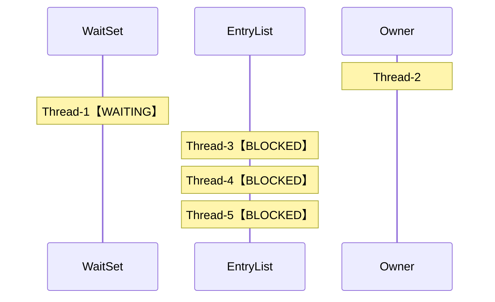
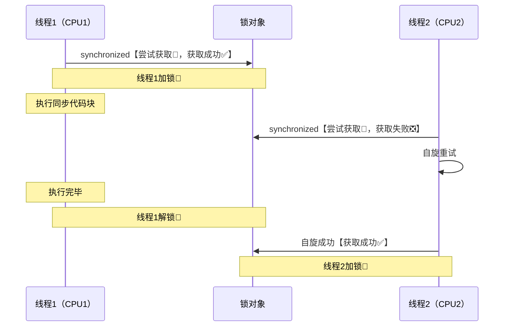

# 基本概念

## 进程与线程

### 二者概念

**【进程】**

- 进程是操作系统结构的基础，是程序在一个数据集合上运行的过程，是系统进行资源分配和调度的基本单位。
- 程序由指令和数据组成，但这些指令要运行，数据要读写，就必须将指令加载至CPU，数据加载至内存。在指令运行过程中还需要用到磁盘、网络等设备。进程就是用来加载指令、管理内存、管理IO等。
- 当一个程序被运行，从磁盘加载这个程序的代码至内存，这时就开启了一个进程。
- 进程就可以视为程序的一个实例。有的程序可以同时运行多个实例进程（浏览器），有的只能运行一个实例进程（QQ音乐）

**【线程】**

- 线程是操作系统调度的最小单位，也叫作轻量级进程。
- 一个进程内可以分为多个线程。
- 一个线程就是一个指令流，将指令流中的一条条指令以一定的顺序交给CPU执行。
- Java中，线程作为最小调度单位，进程作为资源分配的最小单位。在windows中进程是不活动的，只是作为线程的容器。

### 二者区别

- 进程基本上相互独立的，而线程存在于进程内，是进程的一个子集。

- 迸程拥有共享的资源，如内存空间等，供其内部的线程共享。

- 进程间通信较为复杂：

  - 同一台计算机的进程通信称为 IPC (Inter-process communication)。
  - 不同计算机之间的进程通信，需要通过网络，并遵守共同的协议，例如http。

- 线程通信相对简单，因为它们共享进程内的内存，例如多个线程可以访问同一个共享变量。

- 线程更轻量，线程上下文切换成本一般上要比进程上下文切换低。

## 并行与并发

**【并行 parallel】**

在同一时刻，有多条指令在多个处理器上同时执行。在宏观上和微观上，都是一起执行的。


当系统有一个以上 CPU 时，则线程的操作有可能并行。当一个 CPU 执行一个线程时，另一个 CPU 可以执行另一个线程，两个线程互不抢占 CPU 资源，可以同时进行。

**【并发 concurrency】**

在同一时刻，只有一条指令执行，但多个指令被快速的轮换执行。在宏观上是一起执行的效果，在微观上不是一起执行。


当系统只有一个 CPU时，则它不可能同时进行一个以上的线程，只能把 CPU 运行时间划分成若干个时间段，再将时间段分配给各个线程执行，在一个时间段的线程代码运行时，其它线程处于挂起状态。

------

<br/>

# 线程

## 线程运行的原理

### 栈与栈帧

JVM 虚拟机在每个线程启动后，就会为其分配一块 Java 虚拟机栈内存。


- 每个栈由多个栈帧组成，对应着每次方法调用时所占用的内存。
- 每个线程只能有一个活动栈帧，对应着当前正在执行的那个方法。

### 线程上下文切换

因为一些原因导致 CPU 不再执行当前的线程，转而执行另一个线程的代码。

- 线程的 CPU 时间片用完。
- 垃圾回收。
- 有更高优先级的线程需要运行。
- 线程自己调用了 `sleep`、`yield`、`wait`、`join`、`park`、`synchronized`、`lock` 等方法。

当上下文切换发生时，需要由操作系统**保存当前线程的状态，并恢复另一个线程的状态**，Java 中程序计数器就是用来记住下一条 JVM 指令的执行地址， 是线程私有的。

- 状态包括程序计数器、虚拟机栈中每个栈帧的信息，如局部变量、操作数栈、返回地址等。
- 上下文切换频繁发生会影响性能。 

## 创建线程

### 直接创建 Thread

创建一个 `Thread` 对象，并重写 `run` 方法。

```java
Thread thread = new Thread("subThread"){
    @Override
    public void run() {
        System.out.println("run subThread!");
    }
};
thread.start();
System.out.println("run main!");
```

> run subThread!
>
> run main!

### 结合 Runnable

创建一个 `Runnable` 对象，并重写 `run` 方法；再创建一个 `Thread` 对象，并传入 `Runnable` 对象。

⭐ **推荐使用**：能使**任务**和**线程**解耦。

```java
Runnable runnable = new Runnable() {
    @Override
    public void run() {
        System.out.println("run runnable!");
    }
};
Thread thread = new Thread(runnable, "subThread");
thread.start();
System.out.println("run main!");
```

> run main!
>
> run runnable!

### 结合 FutureTask

创建一个 `FutureTask` 对象，并传入 `Callable` 对象且重写 `call` 方法；再创建一个 `Thread` 对象，并传入 `FutureTask` 对象。

**用途**：`FutureTask` 能够接收 `Callable` 类型的参数，用来处理有返回结果的情况。

```java
FutureTask<Integer> futureTask = new FutureTask<>(new Callable<Integer>() {
    @Override
    public Integer call() throws Exception {
        System.out.println("run futureTask!");
        return 200;
    }
});
Thread thread = new Thread(futureTask, "subThread");
thread.start();
// 获取任务执行完后的返回值。会阻塞当前线程，直到任务结束返回之后，才继续运行
System.out.println(futureTask.get());
System.out.println("run main!");
```

> run futureTask!
>
> return 200
>
> run main!

## 常见方法

### start() 与 run()

**start()**：

- 启动线程，真正的多线程运行，无需等待 `run()` 方法执行完毕而直接继续执行下面的代码。
- 调用 `start()` 后，线程就处于就绪（可运行）状态，但并没有运行，一旦得到 CPU 时间片，就开始执行 `run() `，`run()` 方法运行结束，此线程随即终止。

```java
Thread thread = new Thread(() -> System.out.println("run subThread!"));
thread.start();
System.out.println("run main!");
```

> run main!
>
> run subThread!

**run()**： 

- 使用当前线程运行 `run()` 方法中的线程体，并不会创建一个线程，因此必须等待 `run()` 方法执行完毕后才能继续执行后面的代码。

```java
Thread thread = new Thread(() -> System.out.println("run subThread!"));
thread.run();
System.out.println("run main!");
```

> run subThread!
>
> run main!

### sleep() 与 yield()

**sleep():**

- 调用 `sleep()` 会让当前线程从 Running 进入Tined Waiting 状态。
- 其它线程可以使用 `interrupt()` 方法打断正在睡眠的线程，这时 `sleep() `方法会抛出 `InterruptedException`。
- 睡眠结束后的线程未必会立刻得到执行。
- 建议用 `TimeUnit` 的 `sleep()` 代替 `Thread` 的 `sleep()` 来获得更好的可读性。

```java
Thread thread = new Thread(() -> {
    try {
        // 内部进行单位换算，比Thread.sleep(1000)可读性更高
        TimeUnit.SECONDS.sleep(1);
    } catch (InterruptedException e) {
        e.printStackTrace();
    }
});
System.out.println(thread.getState());  // NEW
thread.start();
// 主线程先运行，则子线程可能还没执行run方法
System.out.println(thread.getState());  // RUNNABLE 或 TIMED_WAITING
// 子线程肯定已经执行到run方法
Thread.sleep(100);
System.out.println(thread.getState());  // TIMED_WAITING
// 子线程在睡眠时被打断，则子线程抛出异常
thread.interrupt();                     // java.lang.InterruptedException: sleep interrupted。
```

**yield()：**

- 调用 `yield()` 会让当前线程从 Running 进入 Runnable 状态，然后调度执行其它同优先级的线程。如果这时没有同优先级的线程，那么不能保证让当前线程暂停的效果。
- 主动让出 CPU 使用权，但如果只有一个线程在运行，则让不出去。具体的实现依赖于操作系统的任务调度器。

**线程优先级**：

- 线程优先级会提示 (hint) 调度器优先调度该线程，但它仅仅是一个提示，调度器可以忽略它。
- 如果 CPU 比较忙，优先级高的线程会获得更多的时间片，但 CPU 闲时，优先级几乎没作用。

**sleep() 和 yield() 的应用**

防止 CPU 利用率100%。在没有利用 CPU 来计算时（如：线程保活），不要让 `while(true) `空转浪费 CPU。这时可以使用 `yield()` 或 `sleep()` 来让出 CPU 的使用权给其他程序。

```java
new Thread(() -> {
    while (true) {
        try {
            // 防止死循环中，CPU利用率达到100%
            TimeUnit.MILLISECONDS.sleep(50);
        } catch (InterruptedException e) {
            e.printStackTrace();
        }
    }
}).start();
```

### join()

等待线程运行结束。使**异步并发**变成**同步并发**执行，把多个线程按顺序执行。

```java
static int i = 0;
public static void main(String[] args) throws Exception {
    Thread thread = new Thread(() -> {
        System.out.println("子线程开始");
        try {
            TimeUnit.SECONDS.sleep(1);
        } catch (InterruptedException e) {
            e.printStackTrace();
        }
        i = 100;
        System.out.println("子线程结束");
    });
    thread.start();
    System.out.println(i);
}
```

由于主线程打印 `i` 的时候，子线程还没有对变量 `i` 赋值

> 0
>
> 子线程开始
>
> 子线程结束

```java
thread.start();
thread.join();
System.out.println(i);
```

如果加上 `thread.join();` 则主线程会等待子线程运行结束后，再执行。

> 子线程开始
>
> 子线程结束
>
> 100

### interrupt()

中断线程。

⭐ **注意：**仅仅是把线程的运行状态置为中断状态，并不会停止线程。需自己去监视线程的状态（抛出 `InterruptedException` 的方法）为并做处理。

**中断处于阻塞状态的线程：**

sleep、wait、join 导致线程处于阻塞状态。

```java
Thread thread = new Thread(() -> {
    System.out.println("子线程开始");
    try {
        TimeUnit.SECONDS.sleep(2);
    } catch (InterruptedException e) {
        e.printStackTrace();
    }
    System.out.println("子线程结束");
});
thread.start();
TimeUnit.SECONDS.sleep(1);
System.out.println("主线程让主线程中断");
thread.interrupt();
// 如果中断是以InterruptedException形式抛出，则isInterrupted为false
// 由于中断已经处理，所以中断标记恢复为false，否则isInterrupted为true
System.out.println("中断标记：" + thread.isInterrupted());
```

> 子线程开始
>
> 主线程让子线程中断
>
> 子线程结束
>
> java.lang.InterruptedException: sleep interrupted
>
> 中断标记：false

**中断处于运行状态的线程：**

```java
Thread thread = new Thread(() -> {
    System.out.println("子线程开始");
    while (true) {
        // isInterrupted()为true，终止死循环，则子线程结束
        if (Thread.currentThread().isInterrupted()) break;
    }
    System.out.println("子线程结束");
});
thread.start();
TimeUnit.SECONDS.sleep(1);
System.out.println("主线程让子线程中断");
thread.interrupt();
TimeUnit.SECONDS.sleep(1);
// 同理，由于子线程内部已经处理了此次中断，所以中断标记恢复为false
System.out.println("中断标记：" + thread.isInterrupted());
```

> 子线程开始
>
> 主线程让子线程中断
>
> 子线程结束
>
> 打断标记：false

**中断处于Park状态的线程：**

```java
Thread thread = new Thread(() -> {
    System.out.println("子线程park");
    LockSupport.park();
    System.out.println("子线程unpark");
    System.out.println("中断标记：" + Thread.currentThread().isInterrupted());
    LockSupport.park(); // 由于中断标记为true，因此再次park无效
    System.out.println("子线程继续运行");
});
thread.start();
TimeUnit.SECONDS.sleep(1);
System.out.println("主线程让子线程中断");
thread.interrupt();
```

> 子线程park
>
> 主线程让子线程中断
>
> 子线程unpark
>
> 中断标记：true
>
> 子线程继续运行

## 终止线程-两阶段终止法

A线程优雅的停止B线程，并让B线程完成收尾工作。




```java
Thread thread = new Thread(() -> {
    System.out.println("子线程开始");
    while (true) {
        if (Thread.currentThread().isInterrupted()) {
            // 运行过程中被中断
            System.out.println("执行收尾工作");
            break;
        }
        try {
            TimeUnit.SECONDS.sleep(1);
            System.out.println("执行循环任务");
        } catch (InterruptedException e) {
            e.printStackTrace();
            // 睡眠过程中被中断
            // 抛出异常后中断标记会置为false，所以需要手动将中断标记设为true，以便下一轮循环时能退出
            Thread.currentThread().interrupt();
        }
    }
    System.out.println("子线程结束");
});
thread.start();
// 三秒钟之后中断线程
TimeUnit.SECONDS.sleep(3);
thread.interrupt();
```

> 子线程开始
>
> 执行循环任务
>
> 执行循环任务
>
> 执行循环任务
>
> java.lang.InterruptedException: sleep interrupted
>
> 执行收尾工作
>
> 子线程结束

## 主线程与守护线程

只要有一个线程未结束，进程就不会结束。因此，如果需要主线程运行结束，守护线程（如 GC 线程）也同时结束，则需要将该线程设置为守护线程。

```java
Thread thread = new Thread(() -> {
    while (true) {
        if (Thread.currentThread().isInterrupted()) break;
    }
    // 守护线程在循环中突然结束，后面的代码不会执行。
    System.out.println("守护线程结束");
});
// 设置为守护线程
thread.setDaemon(true);
thread.start();
TimeUnit.SECONDS.sleep(1);
System.out.println("主线程结束");
```

## 线程的状态（五种）

从操作系统层面来理解。


1. **新建状态(New):** 线程对象被创建，未与操作系统线程关联。例如 `Thread thread = new Thread()`。

2. **就绪状态(Runnable):** 线程对象被创建后，其它线程调用了该对象的 `start()` 方法来启动该线程，与操作系统线程关联。这种状态随时可能被CPU调度执行。

3. **运行状态(Running):** 线程获取 CPU 权限进行执行。且线程只能从就绪状态进入到运行状态。如果 CPU 时间片用完，又会切换到就绪状态，同时发生线程上线文切换。

4. **阻塞状态(Blocked):** 阻塞状态是线程因为某种原因放弃 CPU 使用权，暂时停止运行。直到线程进入就绪状态，才有机会转到运行状态。阻塞的情况分三种
- 等待阻塞：通过调用线程的 `wait()` 方法，让线程等待某工作的完成。
  
- 同步阻塞：线程在获取 `synchronized` 同步锁失败（锁被其它线程占用）。
  
- 其他阻塞：通过调用线程的 `sleep()` 或 `join()` 或发出了 `I/O` 请求时，线程会进入到阻塞状态。当 `sleep()` 状态超时、`join()` 等待线程终止或者超时、或者 `I/O` 处理完毕时，线程重新转入就绪状态。
  
5. **终止状态(Dead):** 线程正常结束或异常退出了 `run()` 方法，该线程生命周期结束。

## 线程的状态（六种）

从 Java API （Thread.State）层面来理解。


1. **初始(NEW)：** 新创建了一个线程对象，但还没有调用 `start()` 方法。
2. **运行(RUNNABLE)：** Java 线程中将就绪（ready）和运行中（running）两种状态笼统的称为 “运行”。线程对象创建后，其他线程 (比如 main 线程）调用了该对象的 `start()` 方法。该状态的线程位于可运行线程池中，等待被线程调度选中，获取 CPU 的使用权，此时处于就绪状态（ready）。就绪状态的线程在获得 CPU 时间片后变为运行中状态（running）。
3. **阻塞(BLOCKED)：** 表示线程阻塞于锁。
4. **等待(WAITING)：** 进入该状态的线程需要等待其他线程做出一些特定动作（通知或中断）。
5. **超时等待(TIMED_WAITING)：** 该状态不同于 WAITING，它可以在指定的时间后自行返回。
6. **终止(TERMINATED)：** 表示该线程已经执行完毕。

```java
// NEW：只创建，但是没有运行
Thread thread1 = new Thread(() -> {
});

// RUNNABLE：一直运行
Thread thread2 = new Thread(() -> {
    while (true) {
    }
});
thread2.start();

// TERMINATED：很快就运行结束了
Thread thread3 = new Thread(() -> {
});
thread3.start();

// TIMED_WAITING：睡眠1小时，计时等待。同时对Main.class加锁
Thread thread4 = new Thread(() -> {
    synchronized (Main.class) {
        try {
            TimeUnit.HOURS.sleep(1);
        } catch (InterruptedException e) {
            e.printStackTrace();
        }
    }
});
thread4.start();

// WAITING：等待thread2运行完毕，不计时等待
Thread thread5 = new Thread(() -> {
    try {
        thread2.join();
    } catch (InterruptedException e) {
        e.printStackTrace();
    }
});
thread5.start();

// BLOCKED：thread4已经对Main.class加锁，等待thread4把锁释放
Thread thread6 = new Thread(() -> {
    synchronized (Main.class) {
    }
});
thread6.start();
```

---

<br/>

# 共享模型-管程-悲观锁（阻塞）

## 临界区与竞态条件

### 临界区

一段代码块内如果存在对**共享资源**的多线程**读写**操作，称这段代码块就称为**临界区（Critical Section）**。易发生指令交错，就会出现前面的问题。

```java
private static int count = 0;	// 共享资源
private static void increment()
// 临界区（整个代码块）
{ count++; }

private static void decrement()
// 临界区（整个代码块）
{ count--; }
```

### 竞态条件

**多个线程**在**临界区**内执行，由于代码的**执行序列不同**而导致结果无法预测，称之为发生了**竞态条件（Race Condition）**。

⭐ 避免竞态条件的解决方案：

- 阻塞式：synchronized，lock。
- 非阻塞式：原子变量。

### 多线程读写共享资源引发的问题

```java
public class ThreadTest {

    private static int count = 0;

    public static void main(String[] args) {
        // 线程1对count自增5000次
        Thread thread1 = new Thread(() -> {
            // 临界区，发生了竞态条件
            for (int i = 0; i < 5000; i++) count++;
        });
		// 线程2对count自减5000次
        Thread thread2 = new Thread(() -> {
            // 临界区，发生了竞态条件
            for (int i = 0; i < 5000; i++) count--;
        });

        thread1.start();
        thread2.start();
    }
}
```

- **理想情况**下，两个线程运行结束后 `count == 0` 。
- **实际情况**下，两个线程运行结束后 `count != 0` 。

`i++` 和 `i--` 在 java 中**不是原子操作**。对于 `i++` 而言（`i` 为静态变量），实际会产生如下的 JVM 字节码指令：

```java
getstatic	i	// 获取静态变量i的值
iconst_1		// 准备常量1
iadd			// 自增
putstatic	i 	// 将修改后的值存入静态变量i
```

而对应 `i--` 也是类似：

```java
getstatic	i 	// 获取静态变量i的值
iconst_1		// 准备常量1
isub			// 自减
putstatic	i 	// 将修改后的值存入静态变量i
```

如果在执行指令的同时，发生了**上下文切换**，则可能一次自增和自减后 `i!=0`。



## synchronized 概念

用来给某个目标（对象，方法等）**加锁**，相当于不管哪一个线程运行到这个行时，都必须**先检查**有没有其它线程正在用这个目标，如果有就要**等待**正在使用的线程运行完后**释放**该锁，没有的话则对该目标**先加锁**后**再运行**。

```java
public class ThreadTest {

    private static int count = 0;
    // 锁对象
    private static Object lock = new Object;

    public static void main(String[] args) {
        // 线程1对count自增5000次
        Thread thread1 = new Thread(() -> {
            for (int i = 0; i < 5000; i++) {
                synchronized (lock) count++;
            }
        });
		// 线程2对count自减5000次
        Thread thread2 = new Thread(() -> {
            for (int i = 0; i < 5000; i++) {
                synchronized (lock) count--;
            }
        });

        thread1.start();
        thread2.start();
    }
}
```

对关键操作加上 `synchronized` 后结果就会正确 `count = 0` 。



⭐️ **对 synchronized 的理解：**`synchronized` 实际是用对象锁保证了**临界区**内代码的**原子性**，临界区内的代码对外是不可分割的，也不会被线程切换所打断。

### synchronized 修饰方法

`synchronized` 修饰成员方法：

```java
class Test {
    private Object obj = new Object();
    // 对成员方法加锁，相当于把该类的所有成员给锁住(obj)
    public synchronized void test() {}
}
// 两者在效果上等价
class Test {
    private Object obj = new Object();
    public void test() {
        // 对this加锁，相当于把该类对象给锁住(Test对象)
        synchronized (this) {}
    }
}
```

`synchronized` 修饰静态方法：

```java
class Test {
    public synchronized static void test() { }
}
// 两者在效果上等价
class Test {
    public static void test() {
        // 静态方法，没有实例对象，只能对类对象加锁（Test.class）
        synchronized (Test.class) { }
    }
}
```

### 变量的线程安全分析

**【成员变量和静态变量】**

- 如果没共享，则**线程安全**。

- 如果被共享，根据是否读写来判断：
  - 如果只有读操作，则**线程安全**。
  - 如果有读写操作，则这段代码是临界区，线程不安全。

**【局部变量】**

- 局部变量一般**线程安全**。
- 局部变量引用的对象，根据是否有[方法逃逸](../jvm/JVM内存模型.md)来判断：
  - 如果该对象没有逃离方法的作用访问，则**线程安全**。
  - 如果该对象逃离方法的作用范围，则**线程不安全**。

### 常见的线程安全类

`String`、`Integer`、`StringBuffer`、`Random`、`Vecator`、`HashTable`、`java.util.concurrent` 包下的类。

⭐️ **注意：**

- 这里的线程安全是指多个线程调用它们同一个实例的某个方法时，是线程安全的。

```java
private static Hashtable<String, Integer> hashtable = new Hashtable<>();
// 多个线程调用test()方法
public static void test() {
    // hashtable.put()是原子的，线程安全的
    hashtable.put("TEST", 200);
}
```

- 它们的每个方法是原子的，但它们多个方法的组合不是原子的（可能执行完某一句，但还没执行下一句时，就发生上下文切换）。

```java
private static Hashtable<String, Integer> hashtable = new Hashtable<>();
// 多个线程调用test()方法
public static void test() {
    // hashtable.get()是原子的，线程安全的
    if (hashtable.get("TEST") == null) {
        // hashtable.put()是原子的，线程安全的
        hashtable.put("TEST", 200);
    }
}
```

- 类似 `String` 这种，属于不可变类，自带线程安全属性。

## Monitor

### Java 对象头

由于 Java 面向对象的思想，在 JVM 中需要大量存储对象，存储时为了实现一些额外的功能，需要在对象中添加一些标记字段用于增强对象功能，这些标记字段组成了对象头。

**【对象头形式】**（以32位虚拟机为例）

- **普通对象：**

```
|--------------------------------------------------------|
|               Object Header (64 bits)                  |
|---------------------------|----------------------------|
|    Mark Word (32 bits)    |    Klass Word (32 bits)    |
|---------------------------|----------------------------|
```

- **数组对象：**

```
|---------------------------------------------------------------------------------------|
|                               Object Header (96 bits)                                 |
|---------------------------|----------------------------|------------------------------|
|    Mark Word (32 bits)    |    Klass Word (32 bits)    |    array length (32 bits)    |
|---------------------------|----------------------------|------------------------------|
```

**【对象头的组成】**

主要用来存储对象自身的**运行时数据**，如hashcode、gc 分代年龄等。`mark word` 的位长度为JVM的一个Word大小，也就是说32位JVM的`Mark word`为32位，64位JVM为64位。为了让一个字大小存储更多的信息，JVM将字的最低两个位设置为标记位，不同标记位下的Mark Word示意如下：

```
|-----------------------------------------------------------|--------------------|
|                      Mark Word (32 bits)                  |       State        |
|-----------------------------------------------------------|--------------------|
| identity_hashcode:25 | age:4 | biased_lock:1 | lock:2(01) |       Normal       | 无锁
|-----------------------------------------------------------|--------------------|
|  thread:23 | epoch:2 | age:4 | biased_lock:1 | lock:2(01) |       Biased       | 偏向锁
|-----------------------------------------------------------|--------------------|
|               ptr_to_lock_record:30          | lock:2(00) | Lightweight Locked | 轻量级锁
|-----------------------------------------------------------|--------------------|
|               ptr_to_heavyweight_monitor:30  | lock:2(10) | Heavyweight Locked | 重量级锁
|-----------------------------------------------------------|--------------------|
|                                              | lock:2(11) |    Marked for GC   | GC标记
|-----------------------------------------------------------|--------------------|
```

- **lock：** 锁状态标记位，由于希望用尽可能少的二进制位表示尽可能多的信息，所以设置了lock标记。该标记的值不同，整个mark word表示的含义不同。

- **identity_hashcode：** 对象标识哈希码，采用延迟加载技术。调用方法 `System.identityHashCode()` 计算，并会将结果写到该对象头中。当对象被锁定时，该值会移动到管程 Monitor 中。
- **age：** Java 对象的 GC 年龄，最大15。
- **biased_lock：** 对象是否启用偏向锁标记。1表示对象启用偏向锁，0表示对象没有偏向锁。
- **thread： ** 持有偏向锁的线程ID。
- **epoch：** 偏向时间戳。
- **ptr_to_lock_record：** 指向栈中锁记录的指针。
- **ptr_to_heavyweight_monitor：** 指向管程 Monitor 的指针。

### Monitor

Monitor 被翻译为**监视器**或**管程**。管程提供了一种机制，线程可以临时放弃互斥访问，等待某些条件得到满足后，重新获得执行权恢复它的互斥访问。

每个 Java 对象都可以关联一个 **Monitor 对象**，如果使用 `synchronized` 给对象上锁（重量级）之后，该对象头的 Mark Word 中就被设置指向 Monitor 对象的指针。

**【Monitor 的组成和运行】**



- 刚开始 Monitor 中 Owner 为 `null`。
- 当 Thread-2 执行 `synchronized(obj)` 时，`obj` 的对象头中 `lock` 状态会变为重量级锁，并且对象头中 `ptr_to_heavyweight_monitor` 指针会指向该 Monitor 对象，同时会将 Monitor 的所有者 **Owner** 置为 Thread-2 ，Monitor 同一时间只能有一个 **Owner**。
- 在 Thread-2 上锁后，如果 Thread-3、Thread-4、Thread-5 也来执行 `synchronized(obj)`，由于 Monitor 中的 Owner 不为空，就会进入 **EntryList** 等待锁被释放并变为 **BLOCKED** 状态。
- 当 Thread-2 执行完同步代码块的内容，然后唤醒 **EntryList** 中等待的线程来**非公平竞争锁**。
- **WaitSet** 中的 Thread-1 是之前获得过锁，但条件不满足进入 **WAITING** 状态的线程，后面讲 wait-notify 时会分析。

 **注意：**

- `synchronized` 必须是进入同一个对象的 monitor 才有上述的效果。
- 不加 `synchronized` 的对象不会关联监视器，不遵从以上规则。

## synchronized 原理

锁的状态总共有四种：**无锁**、**偏向锁**、**轻量级锁**和**重量级锁**。随着锁的竞争，锁可以从偏向锁升级到轻量级锁，再升级的重量级锁（但是只升不降）。

### 轻量级锁

**使用场景：**如果一个对象虽然有多线程访问，但多线程访问的时间是错开的（即没有竞争），那么可以使用轻量级锁来优化。

```java
private static final Object obj = new Object();

public static void method1(){
    synchronized (obj){	// ①
        method2();		
    }					// ④
}

private static void method2() {
    synchronized (obj){	// ②
        
    }					// ③
}
```

**【加锁和解锁流程】**默认是主线程调用 `method1()` 方法

1. **method1() 尝试对锁对象加锁：**
   
- 虚拟机在当前线程（Main Thread）的栈帧中建立一个**锁记录**（Lock Record）的空间，包含`锁记录自身的地址`和`指向锁对象的指针`。
  


   - 尝试用 CAS 把`锁记录自身的地址`和`锁对象的Mark Word`进行交换，由于锁对象的状态为无锁（01），因此交换成功后状态将变为轻量级锁（00）。


2. **method2() 尝试对锁对象加锁：** 但由于锁对象的状态为为轻量级锁（00）且锁对象的 Mark Word 指向当前线程（Main Thread）。因此执行锁重入，则新增一条锁记录作为重入的计数。

   

3. **method2() 尝试对锁对象解锁：** 锁记录的地址为 `NULL` ，表示有重入，只需要移除锁记录，从而使重入计数减1。

   

4. **method1() 尝试对锁对象解锁：** 锁记录的地址不为 `NULL` ，尝试用 CAS 把`锁对象的Mark Word`恢复为对象头。因此交换成功后状态将变为无锁（01）。

### 重量级锁

如果在尝试加轻量级锁的过程中，CAS 操作无法成功，如果有其它线程为此对象加上了轻量级锁（有竞争），就要进行**锁膨胀**，将轻量级锁变为**重量级锁**。

```java
private static final Object obj = new Object();

public static void method(){
    synchronized (obj){	// ①

    }					// ②
}
```

**【加锁和解锁流程】**主线程和其他线程都调用 `method()` 方法

1. **其他线程（Other Thread）尝试对锁对象加轻量级锁：** 由于主线程（Main Thread）已经对该对象加了轻量级锁，因此会加锁失败。


于是**进入锁膨胀**流程：

   - 为锁对象申请 Monitor 锁。
   - 将锁对象的 Mark Word 指向当前 Monitor ，并把状态置为重量级锁（10）。
   - Monitor 的 Owner 则指向
   - 其他线程进入 Monitor 的 EntryList 中并变为 BLOCKED 状态。


2. **主线程（Main Thread）尝试对锁对象解轻量级锁：** 尝试用 CAS 把`锁对象的Mark Word`恢复为对象头，失败。于是进入重量级解锁流程，即按照 Monitor 地址找到 Monitor 对象，设置 Owner 为 `null`，唤醒 EntryList 中 BLOCKED 线程，并把主线程的锁记录转移至其他线程。


### 偏向锁

轻量级锁在没有竞争时（只有一个线程），每次重入仍然需要执行CAS操作。

Java 6 中引入了**偏向锁**来做进一步优化：只有第一次使用 CAS 将线程ID设置到对象的Mark Word头，之后发现这个线程ID是自己的就表示没有竞争，不用重新CAS。以后只要不发生竞争，这个对象就归该线程所有。

**【对象创建时】**

- 如果启用偏向锁（默认开启）：对象创建后，Mark Word 值为0x05（即最后3位为101），且 thread、epoch、age 都为0。
```java
public static void main(String[] args){
    Object obj = new Object();	// 默认添加了偏向锁，但是thread为0，不关联任何线程
    // obj.hashCode();				// 如果执行，则偏向锁会被去掉，Mark Word后3位为001，hashcode有值，等效于禁用偏向锁
    synchronized (obj){			// 保持偏向锁，thread有值，关联当前线程
    }							// 保持偏向锁，thread有值，关联当前线程（始终偏向当前线程）
}
```
- 如果禁用偏向锁：对象创建后，Mark Word 值为0x01（即最后3位为001），且 hashcode（第一次使用时才赋值）、age 都为0。

```java
public static void main(String[] args){
    Object obj = new Object();	// 无锁状态
    synchronized (obj){			// 添加轻量级锁
    }							// 无锁状态（释放掉轻量级锁）
}
```

**【偏向锁的撤销】**

- **hashCode()：** 调用了对象的 `hashCode()`，但偏向锁的对象 MarkWord 中存储的是线程id，如果调用 `hashCode()` 会导致偏向锁被撤销：
  - 轻量级锁会在锁记录中记录 hashCode。
  - 重量级锁会在 Monitor 中记录 hashCode。
- **其他线程抢占：** 当有其它线程使用偏向锁对象时，会将偏向锁升级：
  - 如果持锁线程**未执行完**同步代码块：偏向锁 --> 重量级锁。
  - 如果持锁线程**已执行完**同步代码块：偏向锁 --> 轻量级锁。
- **wait()/notify()：** 调用了对象的 `wait()`或`notify()`方法时，由于只有重量级锁才有效，所以偏向锁 --> 重量级锁。

**【批量重偏向与批量撤销】**

- **批量重偏向：** 如果对象虽然被多个线程访问，但没有竞争，这时偏向了线程T1的对象仍有机会重新偏向T2，重偏向会重
  置对象的Thread ID。当撤销偏向锁阈值超过20次后，jvm会在给这些对象加锁时重新偏向至加锁线程。
- **批量撤销：** 当撤销偏向锁阈值超过40次后，jvm 会把整个类的所有对象都变为不可偏向的，新建的对象也是不可偏向的。

### 自旋优化

重量级锁竞争的时候，还可以使用自旋来进行优化，如果当前线程自旋成功（即这时候持锁线程已经退出了同步块，释放了锁），这时当前线程就可以避免阻塞（从而避免上下文切换）。如果自旋超时，则会自旋失败，当前线程就会进入阻塞状态。



⭐️ **注意**：

- 自旋会占用CPU时间，单核CPU自旋就是浪费，多核CPU自旋才能发挥优势。
- Java 6之后自旋锁是自适应的，比如对象刚刚的一次自旋操作成功过，那么认为这次自旋成功的可能性会高，就多自旋几次；反之，就少自旋甚至不自旋。

- Java 7之后不能控制是否开启自旋功能。

### 同步消除

如果能确定一个对象不会出现线程逃逸，对这个变量的同步措施就可以消除掉。单线程中是没有锁竞争。（即锁和锁块内的对象不会逃逸出线程，就可以把这个同步块取消）

```java
public static void alloc() {
    byte[] b = new byte[2];
    // 不会线程逃逸，所以该同步锁可以去掉
    // 开启使用同步消除执行时间 10 ms左右
    // 关闭使用同步消除执行时间 3870 ms左右
    synchronized (b) {
         b[0] = 1;
    }
}

public static void main(String[] args) {
    for (int i = 0; i < 100000000; i++) {
         alloc();
    }
}
```

