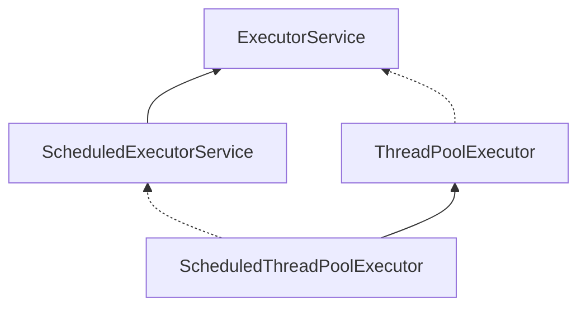

<!-- TOC -->

- [1. Java 线程池](#1-java-线程池)
  - [1.1. 线程池的特点](#11-线程池的特点)
  - [1.2. Java 中的线程池类](#12-java-中的线程池类)
  - [1.3. 线程池的最佳容量](#13-线程池的最佳容量)
- [2. ThreadPoolExecutor](#2-threadpoolexecutor)
  - [2.1. 线程池状态](#21-线程池状态)
  - [2.2. 基本原理](#22-基本原理)
    - [2.2.1. 构造方法](#221-构造方法)
    - [2.2.2. 组成部分](#222-组成部分)
    - [2.2.3. 工作流程](#223-工作流程)
  - [2.3. 拒绝策略](#23-拒绝策略)
    - [2.3.1. JDK 的4种策略](#231-jdk-的4种策略)
    - [2.3.2. 其他策略](#232-其他策略)
  - [2.4. Executors 工厂](#24-executors-工厂)
    - [2.4.1. newFixedThreadPool()](#241-newfixedthreadpool)
    - [2.4.2. newCachedThreadPool()](#242-newcachedthreadpool)
    - [2.4.3. newSingleThreadExecutor()](#243-newsinglethreadexecutor)
  - [2.5. 提交任务](#25-提交任务)
    - [2.5.1. execute()](#251-execute)
    - [2.5.2. submit()](#252-submit)
    - [2.5.3. InvokeAll()](#253-invokeall)
    - [2.5.4. InvokeAny()](#254-invokeany)
  - [2.6. 关闭线程池](#26-关闭线程池)
    - [2.6.1. shutdown()](#261-shutdown)
    - [2.6.2. shutdownNow()](#262-shutdownnow)
  - [2.7. 任务调度线程池](#27-任务调度线程池)
    - [2.7.1. Timer](#271-timer)
    - [2.7.2. ScheduledThreadPoolExecutor](#272-scheduledthreadpoolexecutor)
  - [2.8. 线程池的异常处理](#28-线程池的异常处理)
    - [2.8.1. try/catch](#281-trycatch)
    - [2.8.2. FutureTask](#282-futuretask)

<!-- /TOC -->

# 1. Java 线程池

线程池是一种多线程处理形式，处理过程中可以将任务（Runnable、Callable）添加到队列中，然后在创建线程后自动启动这些任务。

## 1.1. 线程池的特点

使用线程池可以根据系统的需求和硬件环境灵活的**控制线程数量**，且可以对所有线程进行**统一管理**，提高系统运行效率，降低系统运行压力。

- 线程和任务分离，提升线程重用性。
- 控制线程并发数量，降低服务器压力，统一管理所有线程。
- 复用已有线程，节省线程创建和销毁的时间，提升系统响应速度。

## 1.2. Java 中的线程池类



## 1.3. 线程池的最佳容量

**【容量影响】**

- 过小会导致程序不能充分地利用系统资源、容易导致饥饿。
- 过大会导致更多的线程上下文切换，占用更多内存。

**【CPU密集型运算】**

CPU总是处于繁忙状态。通常采用CPU核数+ 1能够实现最优的CPU利用率，+1是保证当线程由于页缺失故障（操作系统）或其它原因导致暂停时，额外的这个线程就能顶上去，保证CPU时钟周期不被浪费。

**【I/O密集型运算】**

CPU不总是处于繁忙状态。例如，当你执行业务计算时，这时候会使用CPU资源，但当你执行I/O操作时、远程RPC调用时，包括进行数据库操作时，这时候CPU就闲下来了，你可以利用多线程提高它的利用率。

**【经验公式】**
$$
线程数 = \frac {核数×期望CPU利用率×CPU总时间(计算时间+等待时间)}{CPU计算时间}
$$
例如4核CPU计算时间是50%，其它等待时间是50%，期望CPU被100%利用，套用公式：`4 × 100% × 100% ÷ 50% = 8`。

例如4核CPU计算时间是10%，其它等待时间是90%，期望CPU被100%利用，套用公式：`4 × 100% × 100% ÷ 10% = 40`。

---

<br/>

# 2. ThreadPoolExecutor

## 2.1. 线程池状态

ThreadPoolExecutor 使用 int 的高3位来表示线程池状态，低29位表示线程数量。

| 状态       | 高3位 | 接收新任务 | 处理队列任务 | 说明                                 |
| ---------- | ----- | ---------- | ------------ | ------------------------------------ |
| RUNNING    | 111   | ⭕          | ⭕            | 初始化状态和运行中状态               |
| SHUTDOWN   | 000   | ❌          | ⭕            | 不接收新任务，只处理队列中剩余的任务 |
| STOP       | 001   | ❌          | ❌            | 中断正在执行的任务，抛弃队列中的任务 |
| TIDYING    | 010   |            |              | 任务执行完毕，活动线程为0，即将终结  |
| TERMINATED | 011   |            |              | 线程池已终结                         |

从数字上比较，TERMINATED > TIDYING > STOP > SHUTDOWN > RUNNING。

用一个原子变量 `ctl` 来存储是为了能在一次 CAS 操作中，既能修改状态，也能修改数量。

## 2.2. 基本原理

### 2.2.1. 构造方法

```java
public ThreadPoolExecutor(int corePoolSize,							// 核心线程数（不会被销毁的线程数）
                              int maximumPoolSize,					// 最大线程数（核心线程数 + 非核心线程数）
                              long keepAliveTime,					// 非核心线程的生存时间
                              TimeUnit unit,						// 非核心线程的生存时间单位
                              BlockingQueue<Runnable> workQueue,	// 工作队列（需要自己设置队列的容量）
                              ThreadFactory threadFactory,			// 线程工厂（可以为线程起个名字）
                              RejectedExecutionHandler handler		// 饱和拒绝策略
                         )
```

### 2.2.2. 组成部分

- **核心线程**： 提交新任务时，首先检查已创建的核心线程数：
  - 如果数量**未达到核心线程数**，则新建一个核心线程，并且将这个任务交由这个核心线程执行。
  - 如果数量**已达到核心线程数**，则不会新建核心线程，而会将这个任务放入工作队列中。
- **工作队列：** 当核心线程执行完一个任务后，会去工作队列中拉取一个新任务继续执行。一般是一个线程安全的有界阻塞队列。
- **非核心线程： **如果继续提交新任务，且工作队列中的任务数量已达到队列的最大容量，当前线程数没有超过最大线程数，则会新建一个非核心线程执行这个任务。（核心线程和非核心线程本质上它们没有什么区别）
- **线程生存时间：** 非核心线程空闲之后，超过这个时间还没有任务执行，该线程结束。
- **饱和拒绝策略：** 当工作队列已满，线程数也达到最大线程数时，线程池会根据饱和策略来执行后续操作。

### 2.2.3. 工作流程


**【类比理解】**

有一家银行（线程池），有两个固定窗口（核心线程数为2），3位工作人员（最大线程数为3），等候座位（任务队列），一个规则《超出银行最大接待能力处理办法》（饱和拒绝策略）：

- A客户（任务A）去银行（线程池）办理业务，但银行刚开始营业，窗口服务员还未就位（相当于线程池中初始线程数量为0），于是经理（线程池管理者）就安排1号工作人员（创建核心线程1去执行任务）接待A客户。
- 在A客户业务还没办完时，B客户（任务B）又来了，于是经理（线程池管理者）就安排2号工作人员（创建核心线程2去执行任务）接待B客户。
- 在A、B客户都没有办完业务的情况下，C客户（任务C）来了，于是经理（线程池管理者）就安排C客户先坐到等候座位上，并告知他：如果1、2号工作人员空出，C客户就可以前去办理业务。
- 此时D客户（任务D）又来了，（两个窗口都在忙，等候座位也满了）于是经理（线程池管理者）赶紧安排3号工作人员（创建非核心线程3去临时执行任务D）在大堂站着给D客户办理业务。
- 假如前面的业务都没有结束的时候E客户（任务E）又来了，此时2位窗口工作人员，和1位临时工作人员都在忙，等候座位也满了，于是经理只能按《超出银行最大接待能力处理办法》（饱和处理机制）拒接接待E客户。
- 最后，进来办业务的人少了，大厅的3号工作人员空闲时间也超过了1个小时（线程生存时间），经理就会让这部分空闲的员工人下班（销毁线程），但是为了保证银行正常工作（有一个 `allowCoreThreadTimeout` 变量控制是否允许销毁核心线程，默认 `false`），即使窗口工作人员闲着也不得提前下班，所以1、2号工作人员继续等待新客户（池内保持核心线程数量）;

## 2.3. 拒绝策略

### 2.3.1. JDK 的4种策略

- **AbortPolicy**：不处理任务，且抛出 `RejectedExecutionException` 异常。【默认策略】
- **CallerRunsPolicy**：不处理任务，交给调用者所在的线程（如主线程）来执行任务。
- **DiscardPolicy**：不处理任务，且不抛出任何异常。
- **DiscardOldestPolicy**：LRU 策略，丢弃队列里最近最久不使用的一个任务，并执行当前任务。

### 2.3.2. 其他策略

- Dubbo 的实现，在抛出 `RejectedExecutionException` 异常之前会记录日志，并 dump 线程栈信息，方便定位问题。
- Netty 的实现，是创建一个新线程来执行任务。
- ActiveMQ 的实现，带超时等待(60s) 尝试放入队列，类似我们之前自定义的拒绝策略。
- PinPoint 的实现，它使用了一个拒绝策略链，会逐一尝试策略链中每种拒绝策略。

## 2.4. Executors 工厂

### 2.4.1. newFixedThreadPool()

创建一个固定线程数的线程池。适用于**任务量小**且任务**相对耗时**的场景。

```java
public static ExecutorService newFixedThreadPool(int nThreads, ThreadFactory threadFactory) {
    return new ThreadPoolExecutor(nThreads, nThreads,
                                  0L, TimeUnit.MILLISECONDS,
                                  new LinkedBlockingQueue<Runnable>(),
                                  threadFactory);
}
```

**【特点】**

- 核心线程数 = 最大线程数（没有非核心线程），无超时时间。
- 阻塞队列是无界的，可以放任意数量的任务。

### 2.4.2. newCachedThreadPool()

创建一个无限线程数的线程池。适用于**任务量大**且任务**相对轻松**的场景。

```java
public static ExecutorService newCachedThreadPool() {
    return new ThreadPoolExecutor(0, Integer.MAX_VALUE,
                                  60L, TimeUnit.SECONDS,
                                  new SynchronousQueue<Runnable>());
}
```

**【特点】**

- 核心线程数是0，最大线程数是 `Integer.MAX_ VALUE`，非核心线程的空闲生存时间是60s，意味着
  - 全部都是非核心线程（60s 后可以回收）。
  - 非核心线程可以无限创建。
- 队列采用了 `SynchronousQueue` 实现，特点是没有容量，没有线程来取是放不进去的（一手交钱、一手交货）。

### 2.4.3. newSingleThreadExecutor()

创建一个单线程的线程池。适用于**任务串行**且任务**相对轻松**的场景。

```java
public static ExecutorService newSingleThreadExecutor() {
    // 装饰器模式，防止外部直接调用ThreadPoolExecutor的方法
    return new FinalizableDelegatedExecutorService
        (new ThreadPoolExecutor(1, 1, 0L, TimeUnit.MILLISECONDS, new LinkedBlockingQueue<Runnable>()));
}
```

**【特点】**

- 线程数固定为1，任务数多于1时，会放入无界队列排队。任务执行完毕，这唯一的线程也不会被释放。

**【区别】**

- 自己创建一个单线程串行执行任务，如果任务执行失败而终止那么没有任何补救措施；而线程池还会新建一个线程，保证池的正常工作。
- `Executors.newSingleThreadExecutor()` 线程个数始终为1且不能修改，`FinalizableDelegatedExecutorService` 应用的是装饰器模式，只对外暴露了`ExecutorService` 接口，因此不能调用 `ThreadPoolExecutor` 中特有的方法。
- `Executors.newFixedThreadPool(1)` 初始时为1，以后还可以修改。对外暴露的是 `ThreadPoolExecutor` 对象，可以强转后调用 `setCorePoolSize` 等方法进行修改。

## 2.5. 提交任务

### 2.5.1. execute()

提交一个不需要返回值的任务，所以无法判断任务是否被线程池执行成功。

```java
ExecutorService threadPool = Executors.newFixedThreadPool(2);
threadPool.execute(() -> System.out.println("执行任务"));
```

**【源码分析】**

```java
public void execute(Runnable command) {
    if (command == null) throw new NullPointerException();
    int c = ctl.get();
    // workerCountOf(c)会获取当前正在运行的worker数量
    if (workerCountOf(c) < corePoolSize) {
        // 如果workerCount小于corePoolSize，就创建一个worker然后直接执行该任务
        if (addWorker(command, true)) return;
        c = ctl.get();
    }
    // isRunning(c)是判断线程池是否在运行中，如果线程池被关闭了就不会再接受任务
    // workQueue.offer(command)是将任务加入到队列中
    if (isRunning(c) && workQueue.offer(command)) {
        // 如果添加到队列成功了，会再检查一次线程池的状态
        int recheck = ctl.get();
        // 如果线程池关闭了，就将刚才添加的任务从队列中移除
        if (! isRunning(recheck) && remove(command))
            // 执行拒绝策略
            reject(command);
        else if (workerCountOf(recheck) == 0)
            addWorker(null, false);
    }
    // 如果加入队列失败，就尝试直接创建worker来执行任务
    else if (!addWorker(command, false))
        // 如果创建worker失败，就执行拒绝策略
        reject(command);
}
```

### 2.5.2. submit()

提交一个需要返回值的任务。

```java
ExecutorService threadPool = Executors.newFixedThreadPool(2);
Future<String> future = threadPool.submit(() -> {
    System.out.println("执行任务");
    return "OK";
});
try {
    Thread.sleep(100);
    System.out.println(future.get());	// OK
} catch (InterruptedException | ExecutionException e) {
    e.printStackTrace();
}
```

### 2.5.3. InvokeAll()

批量提交需要返回值的任务。

```java
ExecutorService threadPool = Executors.newFixedThreadPool(2);
List<Future<String>> futures = threadPool.invokeAll(Arrays.asList(
        () -> {
            System.out.println("执行任务1");
            return "OK1";
        },
        () -> {
            System.out.println("执行任务2");
            return "OK2";
        }
));
Thread.sleep(100);
for (Future<String> future : futures) {
    try {
        System.out.println(future.get());
    } catch (ExecutionException e) {
        e.printStackTrace();
    }
}
```

### 2.5.4. InvokeAny()

批量提交需要返回值的任务。哪个任务先成功执行完毕，返回此任务执行结果，然后取消其它任务。

```java
ExecutorService threadPool = Executors.newFixedThreadPool(2);
String future = threadPool.invokeAny(Arrays.asList(
        () -> {
            System.out.println("执行任务1");
            return "OK1";
        },
        () -> {
            System.out.println("执行任务2");
            return "OK2";
        }
));
Thread.sleep(100);
System.out.println(future);		// OK1 或者 OK2
```

## 2.6. 关闭线程池

### 2.6.1. shutdown()

不会立即终止线程池，而是要等所有工作队列中的任务都执行完后才终止，但也不会再接受新的任务。

```java
ExecutorService threadPool = Executors.newFixedThreadPool(2);
threadPool.shutdown();
```

**【源码分析】**

```java
public void shutdown() {
    final ReentrantLock mainLock = this.mainLock;
    mainLock.lock();
    try {
        checkShutdownAccess();
        // 把线程池的状态置为 SHUTDOWN
        advanceRunState(SHUTDOWN);
        // 中断空闲线程
        interruptIdleWorkers();
        // ScheduledThreadPoolExecutor用来hook的地方
        onShutdown();
    } finally {
        mainLock.unlock();
    }
    // 尝试终结线程池（没有运行的线程可以立刻终结，如果还有运行的线程也不会等）
    tryTerminate();
}
```

### 2.6.2. shutdownNow()

先将线程池的状态设置成 STOP，然后尝试停止所有的正在执行或暂停任务的线程，并返回等待执行任务的列表。

```java
ExecutorService threadPool = Executors.newFixedThreadPool(2);
threadPool.shutdownNow();
```

**【源码分析】**

```java
public List<Runnable> shutdownNow() {
    List<Runnable> tasks;
    final ReentrantLock mainLock = this.mainLock;
    mainLock.lock();
    try {
        checkShutdownAccess();
        // 把线程池的状态置为 STOP
        advanceRunState(STOP);
        // 中断全部线程
        interruptWorkers();
        // 获取队列中的剩余任务
        tasks = drainQueue();
    } finally {
        mainLock.unlock();
    }
    // 尝试终结线程池（没有运行的线程，因此立刻终结）
    tryTerminate();
    return tasks;
}
```

## 2.7. 任务调度线程池

### 2.7.1. Timer

Timer 简单易用，但由于所有任务都是由同一个线程来调度，因此所有任务都是**串行执行**的，前一个任务的**延迟或异常**都将会影响到之后的任务。

```java
public static void main(String[] args) {
    Timer timer = new Timer();
    TimerTask task1 = new TimerTask() {
        @Override
        public void run() {
            Log.println("task1");
            Thread.sleep(1000);
        }
    };
    TimerTask task2 = new TimerTask() {
        @Override
        public void run() {
            Log.println("task2");
            Thread.sleep(1000);
        }
    };
    timer.schedule(task1, 0);
    timer.schedule(task2, 0);	// 任务2要等待任务1执行完毕才能执行
}
```

### 2.7.2. ScheduledThreadPoolExecutor

- **schedule()**：添加延时任务。
- **scheduleAtFixedRate()**：添加固定速率的循环延时任务（上一个任务未结束，当前任务也是按时执行）。
- **scheduleWithFixedDelay()**：添加固定延时的循环延时任务（等待上一个任务结束，再等待延时时间后才执行当前任务）。

## 2.8. 线程池的异常处理

### 2.8.1. try/catch

```java
public static void main(String[] args) {
    ExecutorService threadPool = Executors.newFixedThreadPool(1);
    threadPool.submit(() -> {
        Log.println("running...");
        // 自行捕获异常
        try {
            int i = 1 / 0;
        } catch (Exception e) {
            e.printStackTrace();
        }
    });
}
```

> 15:32:08:572: running...
>
> java.lang.ArithmeticException: / by zero

### 2.8.2. FutureTask

```java
public static void main(String[] args) throws ExecutionException, InterruptedException {
    ExecutorService threadPool = Executors.newFixedThreadPool(1);
    Future<String> future = threadPool.submit(() -> {
        Log.println("running...");
        int i = 1 / 0;
        return "OK";
    });
    // 如果FutureTask执行成功，则get()获取到返回值，如果执行失败，则抛出异常
    Log.println(future.get());
}
```

> 15:35:12:300: running...
>
> Exception in thread "main" java.util.concurrent.ExecutionException: java.lang.ArithmeticException: / by zero

